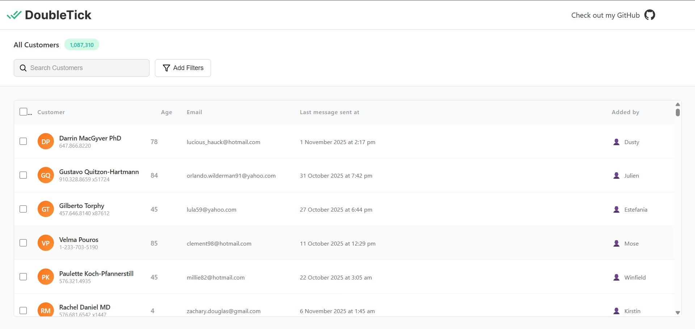

# DoubleTick - Frontend Assignment

A high-performance customer management application built with React and Vite, capable of handling over 1 million customer records with smooth virtual scrolling, real-time search, and advanced sorting capabilities.



## 🚀 Features

### Core Functionality
- **Massive Data Handling**: Efficiently manages 1+ million customer records using IndexedDB
- **Virtual Scrolling**: Smooth performance with `@tanstack/react-virtual` - only renders visible rows
- **Real-time Search**: Fast search across customer name, email, and phone number
- **Advanced Sorting**: Sort by any column (Customer, Age, Email, Last Message, Added By) in ascending/descending order
- **Background Data Generation**: Uses Web Workers to generate fake customer data without blocking the UI
- **Responsive Design**: Clean, modern UI that adapts to different screen sizes

### Performance Optimizations
- **Virtual Scrolling**: Only renders visible table rows, enabling smooth scrolling through millions of records
- **Debounced Search**: Reduces unnecessary database queries while typing
- **Chunked Data Loading**: Loads data in batches (30 records at a time) for optimal performance
- **Web Worker Integration**: Data generation happens in a separate thread, keeping UI responsive
- **IndexedDB Storage**: Client-side database for fast data access and persistence

## 🛠️ Tech Stack

- **Frontend Framework**: React 19.1.1
- **Build Tool**: Vite 7.1.7
- **Database**: Dexie (IndexedDB wrapper)
- **Virtual Scrolling**: @tanstack/react-virtual 3.13.12
- **Data Generation**: @faker-js/faker 10.1.0
- **Styling**: CSS3 with modern design patterns

## 📦 Installation

1. **Install dependencies**
   ```bash
   npm install
   ```

2. **Start the development server**
   ```bash
   npm run dev
   ```

3. **Open your browser**
   Navigate to `http://localhost:5173` (or the port shown in terminal)

## 🎯 Usage

### Initial Setup
- On first launch, the application automatically checks the database
- If less than 1 million records exist, a Web Worker starts generating fake customer data
- The UI remains fully functional while data is being generated in the background

### Features Guide

#### Search Customers
- Type in the search box to filter customers by:
  - Name
  - Email address
  - Phone number
- Search is case-insensitive and updates in real-time

#### Sort Data
- Click any column header to sort:
  - First click: Ascending order (▲)
  - Second click: Descending order (▼)
- Sortable columns: Customer, Age, Email, Last Message Sent At, Added By

#### View Customer Details
Each customer row displays:
- **Avatar**: Circular badge with customer initials
- **Name & Phone**: Full name with phone number below
- **Age**: Customer age (0-100)
- **Email**: Customer email address
- **Last Message**: Formatted timestamp of last message sent
- **Added By**: User who added the customer

#### Filter Options
- Click "Add Filters" button to access filter dropdown (currently placeholder)

## 📁 Project Structure

```
doubletickk/
├── src/
│   ├── components/
│   │   ├── Header.jsx          # Header with logo, search, and filters
│   │   └── CustomerList.jsx    # Main table component with virtual scrolling
│   ├── lib/
│   │   └── db.js              # Database operations and queries
│   ├── assets/                # Images and SVG icons
│   ├── App.jsx                # Main application component
│   ├── App.css                # Global styles
│   ├── main.jsx              # Application entry point
│   └── generate-worker.js    # Web Worker for data generation
├── public/
├── index.html
├── package.json
└── README.md
```

## 🔧 Available Scripts

- `npm run dev` - Start development server with hot module replacement
- `npm run build` - Build production-ready bundle
- `npm run preview` - Preview production build locally
- `npm run lint` - Run ESLint to check code quality

## ⚡ Performance

- **Initial Load**: Fast startup with immediate UI rendering
- **Data Generation**: Non-blocking background generation using Web Workers
- **Scrolling**: Smooth 60fps scrolling through millions of records
- **Search**: Instant results with debounced input (250ms delay)
- **Sorting**: Fast column sorting with IndexedDB indexes

## 🚀 Key Implementation Details

### Virtual Scrolling
- Uses `@tanstack/react-virtual` for efficient rendering
- Only renders visible rows plus overscan buffer
- Dynamically loads data based on scroll position
- Prevents header overlap with calculated padding

### Data Generation
- Generates data in chunks of 30 records
- Uses Web Worker to avoid blocking main thread
- Progress updates sent to main thread every chunk
- Total target: 1,000,000 customer records

### Database Architecture
- IndexedDB schema with indexes on all searchable fields
- Efficient queries using Dexie's query builder
- Supports case-insensitive search operations
- Optimized for read-heavy workloads

## 🙏 Acknowledgments

- Built with [React](https://react.dev/)
- Powered by [Vite](https://vitejs.dev/)
- Database by [Dexie](https://dexie.org/)
- Virtual scrolling by [TanStack Virtual](https://tanstack.com/virtual)
- Fake data by [Faker.js](https://fakerjs.dev/)

---

**Note**: Make sure to add a screenshot image named `screenshot.png` in the root directory to display the UI preview in the README.
